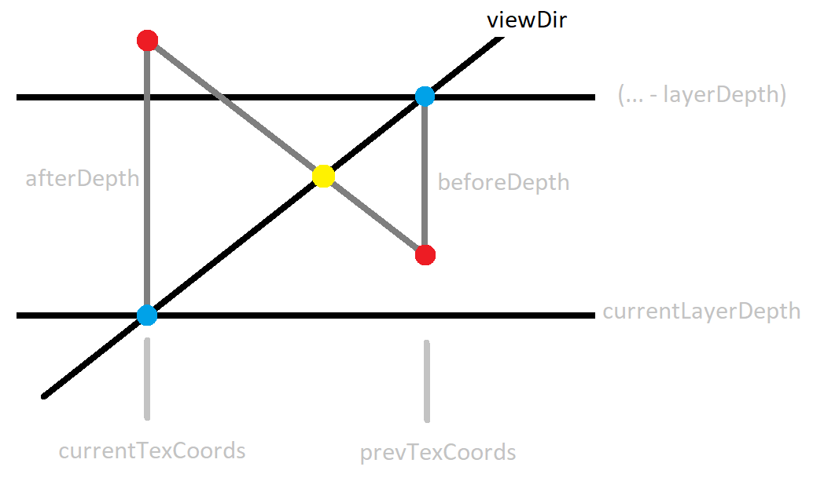
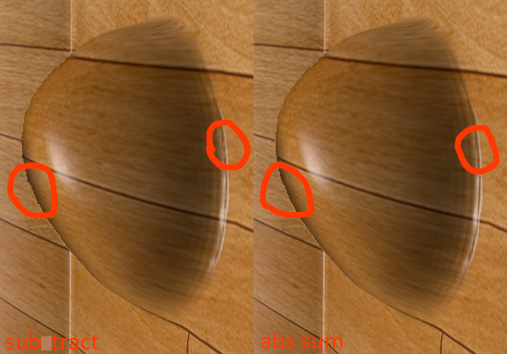

# 视差贴图

用纹理指定片段内有限的几何形状。

实际上是通过计算并采样一个新位置的纹理来实现“凹凸”效果，并没有真正的几何变化。

一般需要和法线贴图配合使用，防止着色出现瑕疵。

偏移后超出 $[0, 1]^2$ 的纹理坐标可以通过 `discard` 丢弃来避免平面边缘的瑕疵。

一个主要问题是如何在 mapping 中取得最接近“真实凹凸网格”效果的 uv 偏移。这是一个求交问题。提高精度的算法有 Relief Parallax Mapping 和 Parallax Occlusion Mapping，前者基于线段二分的思路，精度最高，后者在步进的基础上做线性插值。目前先实现后者。

视差遮蔽贴图的大概示意，蓝点是层深度，红点是采样深度，黄点是要得到的插值点。

## 注意

纹理数值所在的颜色空间是否需要做校正，从纹理采样得到的数值何时单位化。

注意偏移纹理 uv 时的向量符号。

教程里的视差遮蔽贴图使用的插值公式有点奇怪，不是根据相似三角形正常推导出来的求和，而是相减。效果也不太行，估计是为了减少运算？

