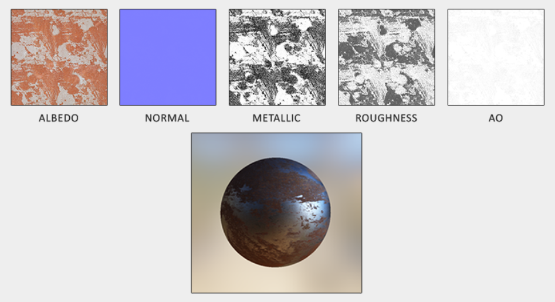

# PBR

~~PBR 是浪漫！~~

先放渲染方程：

$$
L_o(p, \omega_o) = L_e(p, \omega_o) + \int_\Omega L_i(p, \omega_i)f_r(p, \omega_i, \omega_o)\cos\theta\mathrm{d}\omega_i
$$

~~这是真实感渲染的万有引力定律。~~

基于物理的渲染是一系列以数学和物理模型为基础的、尽可能近似现实世界的渲染技术。PBR 意在模拟物理正确的光照，不仅能给出非常真实的渲染效果，还允许符合现实直觉的参数输入。其最大的缺点也源于模拟的本质：计算量大且复杂。而且，PBR 的 B 代表其始终是真实世界的一个近似渲染。

PBR 要求模型符合以下几条：

- 使用微表面模型
- 能量守恒
- 使用基于物理的 BRDF

更详细的内容可以参考 pbrt。

## 微表面模型

利用微表面模型来统一表达并调整物体表面的粗糙程度。这里的微表面只是一个统计上的表达，并不需要一一表示出来，例如只需要知道着色片段覆盖的区域内与半向量垂直的微表面占多大比例。

## 能量守恒

Energy conservation，或者说能量收敛，指出射光的能量不多于入射光的能量（除非这个表面在发光）。

这个特性主要是由 BRDF 保证的。

在一般的模型下，光的去向有两个：反射和折射，可以将它们视为互斥的，同时也包含着所有入射的光能量。

## 反射方程

去掉自发光项的渲染方程。

记几个辐射度量学术语，面试可能会用到：

- 辐射通量 Radiant flux：$\Phi$，一种功率，具体而言是某种波长分布的光源辐射能量的效率（单位为瓦）。这里可以简化为某种颜色的光源。
- 立体角 Solid angle：$\omega$，与平面角（弧度）类似，是形状在单位球上投影的面积（平面角则是单位圆的弧长）（单位为sr，steradian）。
- 辐射强度 Radiant intensity：$I = \frac{\mathrm{d}\Phi}{\mathrm{d}\omega}$，即光源每立体角辐射能量的功率。
- 辐射率/辐亮度 Radiance：$L= \frac{\partial^2{\Phi}}{\cos\theta\partial{A}\partial{\omega}}$，每单位立体角且每单位投射平面的辐射通量。其中 $\theta$ 是单位平面的法向量与立体角方向的夹角，用于修正单位平面沿立体角投射到斜面上产生的面积变化。

立体角变方向向量，面积变片段，就可以在着色器里用上辐射率公式了。实际上在渲染中有用的是来自各个方向（一般是半球）的辐射率之和，即辐照度 Irradiance。

计算渲染方程，一般是求数值解，可以使用黎曼和近似或者（准）蒙特卡洛积分。

## BRDF

双向反射分布函数，用于描述一种材质的反射和折射特性，可以理解成反射光对于立体角的分布。微表面模型即其中一种。大部分实时渲染都使用 Cook-Torrance BRDF，它有 diffuse 和 specular 两项：

$$
f_r = k_{d}f_{lambert} + k_s f_{CookTorrance}
$$

两个系数 $k$ 分别代表入射光能量被折射和反射的比例。

第一项的 Lambertian 漫反射部分很简单，颜色除以 $\pi$（修正积分）。这是一个非常简单但好用的**近似**。

第二项就比较复杂，三个函数和一个标准化除法：

$$
f_{CookTorrance} = \frac{DFG}{4(\omega_o \cdot n)(\omega_i \cdot n)}
$$

- **D**istribution 函数：描述与半程向量对齐的微表面占比。
- **F**resnel 方程：基于物质特性和菲涅尔公式确定反射和折射角度。
- **G**eometry 函数：描述微表面的互相遮挡。过于粗糙的表面会发生这种现象，进一步减少反射出的光。

每一项都有许多种实现方式和公式，侧重点各不相同（性能、准确性等），这里：D 项使用 Trowbridge-Reitz GGX，F 项使用 Fresnel-Schlick 近似，G 项使用 Smith's Schlick-GGX。[“GGX”这三个字母好像没什么含义](https://www.cs.cornell.edu/~srm/publications/EGSR07-btdf.pdf)。

### 法向量分布

Trowbridge-Reitz GGX：

$$
NDF_{GGX TR}(n, h, \alpha) = \frac{\alpha^2}{\pi((n \cdot h)^2 (\alpha^2 - 1) + 1)^2}
$$

其中 $h$ 是半程向量，$\alpha$ 是粗糙度参数，$n$ 是法向量。

### 几何遮挡

Schlick-GGX：

$$
G_{SchlickGGX}(n, v, k) = \frac{n \cdot v} {(n \cdot v)(1 - k) + k }
$$

其中 $k$ 是对 $\alpha$ 的一个重映射，如果是直接光照，$k = \frac{(\alpha+1)^2}{8}$，如果是 IBL，$k=\frac{\alpha^2}{2}$。完整的公式传入了视线方向（微表面遮挡）和光源方向（微表面自阴影）：

$$
G(n, v, l, k) = G_{sub}(n, v, k) G_{sub}(n, l, k)
$$

### 菲涅尔项

所有物质的表面都有基础反射率（垂直视线），并且理论上在 90 度倾斜视线时反射所有光。菲涅尔方程可以确定被反射光的占比。

准确的菲涅尔公式非常复杂，其施利克近似为：

$$
F_{Schlick}(h, v, F_0) = F_0 + (1 - F_0) ( 1 - (h \cdot v))^5
$$

$F_0$ 为基础反射率，由折射系数计算。施利克近似只针对电介质，对于导体需要另一种计算方法，这里直接选择打表近似。

对于电介质而言 $(.04, .04, .04)$ 的基础反射率适合大部分场景。而导体的基础反射率一般更高而且随光谱变化。

电介质和导体的区别导致了一种工作流的出现：金属工作流（metallic workflow）。它使用一个叫做金属性的参数区分一个表面到底是金属还是非金属。金属性一般是二元的，但多数渲染管线视之为线性的，因为依靠纹理难以精确描述“金属与非金属混合在同一表面”的状态。具体来说，金属性参数一般用于控制原始的基础反射率到实际颜色之间的插值，其结果作为参与着色的基础反射率。使用实际颜色是因为金属没有漫反射。

### Cook-Torrance 反射方程

$$
L_o(p,\omega_o) = \int\limits_{\Omega} 
    	(k_d\frac{c}{\pi} + \frac{DFG}{4(\omega_o \cdot n)(\omega_i \cdot n)})
    	L_i(p,\omega_i) \cos\theta  d\omega_i
$$

其中的 $k_s$ 系数由 $F$ 直接代替。

## PBR 材质

PBR 的一大优势就是统一了材质的制作和调整流程。它暴露给创作者的接口如下：

- Albedo：指定颜色或（金属的）基础反射率。与 diffuse 纹理不同的是 albedo 只有颜色/反射率，没有阴影、光照等信息。
- Normal：正交空间下的片段粒度法向量，与前文的法向量纹理相同。
- Metallic：见上文。
- Roughness：微表面模型的统计表现。
- AO：albedo 不包含的遮蔽阴影等信息由 AO 来表现。有的 AO 会包含一部分颜色（bleeding）。

## 其他

[另外一种 PBR 工作流及其与金属/粗糙度工作流的对比](https://substance3d.adobe.com/tutorials/courses/the-pbr-guide-part-2)

